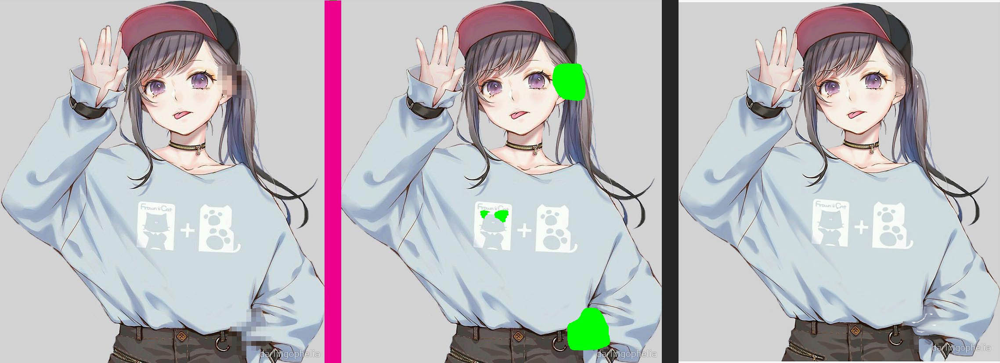
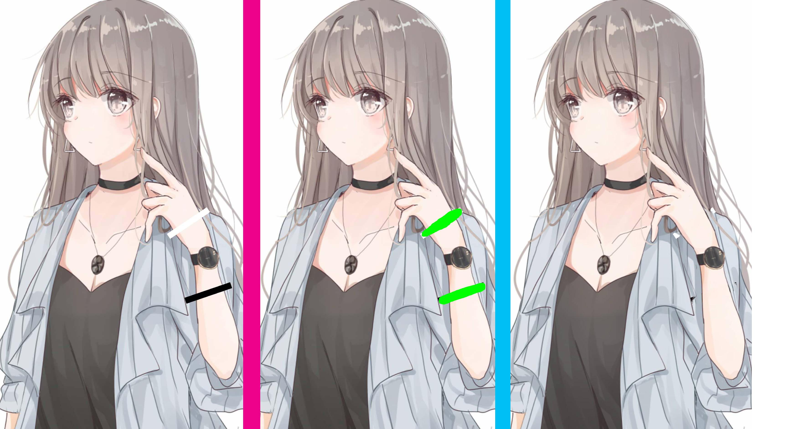
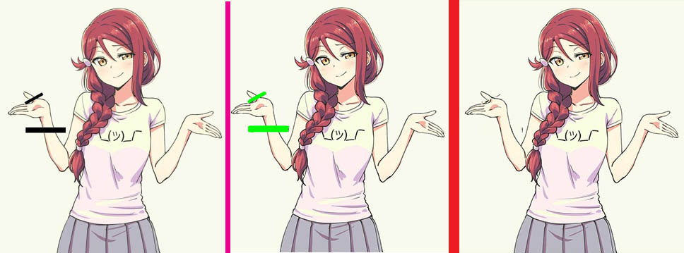
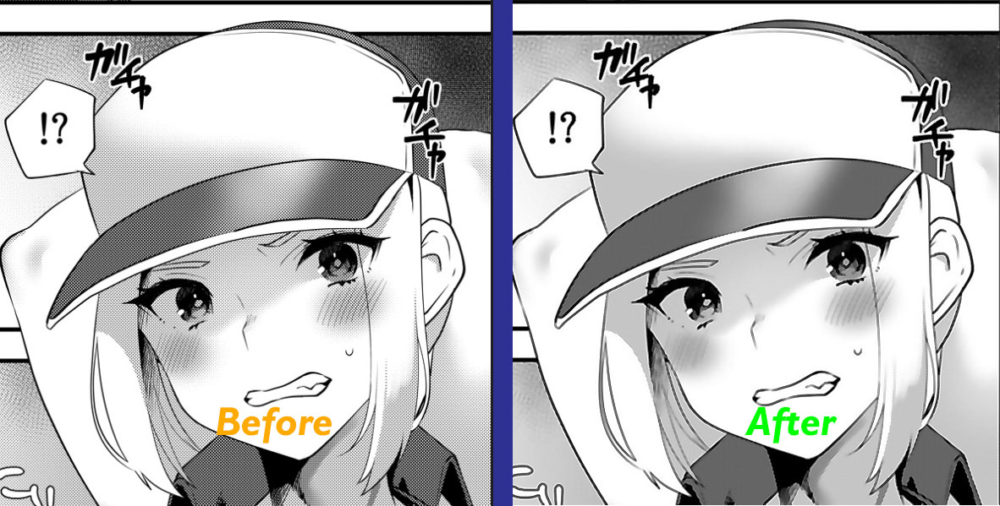

# Detecting censors with deep learning and computer vision

Illustrated adult content created in Japan is required to be censored by law. Two common types of censoring involves censor bars and mosaic blurs. For us degenerates living outside of Japan, this means we are also subject to the bars and mosaics. There is a solution, [DeepCreamPy](https://github.com/deeppomf/DeepCreamPy) by deeppomf that can draw over the censors, given that you tell it where the censors are. That is a long and painstaking process, so I hope to automate that process with this project. This project will utilize deep learning and image segmentation, techniques typically used in autonomous vehicles and computer vision tasks. 

This is an implementation of Matterport's [Mask R-CNN](https://arxiv.org/abs/1703.06870), modified to my liking. 

Here is a [NSFW Video](https://www.pornhub.com/view_video.php?viewkey=ph5e5bdbbcbce66) that shows better what this project does, on current model 161. 

Development news will be posted on my Twitter (NSFW).
[](https://twitter.com/nate_of_hent_ai)

Like what you see? You can send me a tip! (Proceeds also go to my tuition)
[](https://www.paypal.com/cgi-bin/webscr?cmd=_donations&business=CGF4Q3FK2Q2SU&currency_code=USD&source=url)

You can join some discussion on my Discord channel: https://discord.gg/j4dPZ7W 

Example of mosaic detection on dated (Feb 27,2020) model 107:


Examples of bar detection on datad model 107:




For both of those examples, the newest model 161 provides far more accurate masks and detection.

# Getting Started
You will need all the same requirements as matterport's Mask RCNN implementation, nothing more. Note that I am using tensorflow 1.5.0, tensorflow-gpu 1.9.0, and keras 2.2.0. I have not been able to get newer combinations stable. I use Anaconda3 for my command line. 

Only windows is supported, I do not yet have the funding to get an Apple product for development there.

# The code

* [main.py](main.py) Contains GUI and all I/O handling and file parsing, along with basic error detection. Instantiates detector class.

* [detector.py](detector.py) Contains my detector class, which is responsible for neural network bringup, starting inference detection, and creating overlay from mask for DCP.

* [hentai.py](samples/hentai/hentai.py) Interfaces between my detector and the model. Based off of the Balloon.py of the Mask RCNN implementation. Also handles training, and contains the Hentai configuration class.

* [inspect_h_model.ipynb](samples/hentai/inspect_h_model.ipynb) This notebook is identical to the balloon notebook. I modified it to work with this project instead, and it is best used to inspect a model. For detailed logging, use Tensorboard (which should be installed if you have tensorflow)

* [inspect_h_data.ipynb](samples/hentai/inspect_h_data.ipynb)
Same thing as above, except this notebook is used to validate the dataset. Also has cool information showing some of the quirks and features of MaskRcnn

I have only worked on Windows platforms, and had not been able to train or work on other instances like Google colab and Google Cloud.

# The Dataset

Extended the existing Balloon class to support 3 classes: BG, bar, and mosaic. I have decided to not provide my dataset. Annotated with VGG annotator in .json format.

Dataset annotations have were made with the polygon shape. Bar and Mosaic region attributes are formated as:

```
"region_attributes":{"censor":"bar"}} OR "region_attributes":{"censor":"mosaic"}}
```

Currently, the model needs more training. I have access to high-end computers on campus, but someone with a working Google cloud or similar can definitely help. In that case, contact me so I can provide the current dataset. 
[Here](https://drive.google.com/open?id=1J0T6sZx8sN0wyo3Ctg88nlFWg414256j) is a (NSFW) sample of my dataset annotations, along with the vgg editor. You can start off of this sample and build off of it, and hopefully send your dataset to me so I can append it to the current set.

# The Model

I experimented with other pre-trained models, but ended transfer learning with the imagenet model. 

Latest model is model 161, available [here](https://drive.google.com/open?id=1gyP9nIRsJ3pcfjcVLZya1aDVe971wCX4). Latest weights model will come with each release.

Please keep it named as weights.h5, in the root directory with main.py or main.exe.

I have the events file if you would like to see the latest training events with tensorboard [here](https://drive.google.com/open?id=1bH0YcGZQh-hZgGvUpJZc7f9Pblvo3ctE)

## Requirements

You will need to download and install DeepCreamPy, which is linked in the intro.

The executable itself should not have any requirements on Windows. For linux, clone the repo and follow the provided instructions for getting its requirements.

(Source code on Windows) I would reccomend running these on a virtual environment, with Anaconda3.
Python 3.5, TensorFlow 1.5, Keras 2.2, tensorflow-gpu 1.9.0, and other common packages listed in `requirements.txt`.

* For now, DCP is required until I can create my own alternative. This project expects to use the DCP directory. You can install the executable or the source code, either should work.

* DCP is ONLY compatible with .png images, and not jpg. That should be the first thing you do - convert whatever content you want to decensor to png format. You can use online tools like jpg2png. Again, this should be done before anything else.

* DCP is NOT compatible with screentones, or that dotted effect that is characteristic of printed works (see below). Simply refer to my other project, [Screentone Remover](https://github.com/natethegreate/Screentone-Remover), which will batch remove screentones using Digital Signal Processing techniques. This is the only way for printed non-colored images to be decensored.

Here is an example of a screentoned image, and what it looks like when removed by my Screentone Remover app:



## Important Notes (READ BEFORE USING)

* I highly reccommend running hentAI on batches, for example one doujin or a few doujins at once. The slowest part of hentAI is the initialization, so the first inference takes time but the rest will be quick. 

* The current model is not perfect. Yet. Expect some trouble with white censor bars, small censor bars, partially-transparent censor bars, and censor bars that are fused together as one large censor. Any absurd amount of censoring may cause issues for hentAI.

* This model is not trained in recognizing full censorship, where genetalia is not drawn at all. Non-standard censoring is also not supported. 

* The model supports mosaics and bars, but it really struggles when both are used on the same spot. Also, DCP can only generate for bars or mosaics, so you will need to keep mosaic censoring works separate from bar censored works.

* If you choose to try the video detection, PLEASE only do one SHORT clip at a time. More testing is needed with video detection.

* The Video Maker button creates a video from the output of DCP in decensored_output. Run this after DCP completes. Note you still need to select the directories for the source video, and the DCP install directory.

* Do not put entire clips through the video detection, it is a very slow task. If you can, edit in only the clips with visible mosaics, get the decensored output, then edit them in the rest of the video.

## Versions and Downloads

* v1.0: Initial release for 2020 HackIllinois Demo

* v1.1: Cleaned code, removed unneeded library imports, added install instructions and tutorial. Added error detection.

* [v1.2](https://github.com/natethegreate/hentAI/releases/tag/v1.2): Executable release based off of the detect-only branch. Training and redundant libraries have been removed or relocated. Bug where entire image returns green fixed. Lowered detection threshold.

* v1.3: (exe not released yet) Removed non-unicode error. Added loading screen popup. Lowered detection threshold. Minor UI changes.


## Installation directions

For detailed instructions, follow Install_and_Tutorial.txt

Executable:

* Install from the links directly above

* Extract the downloaded file to some folder

* Follow Install_and _tutorial for more 

Code:

* After cloning this repo, first install the requirements:

```
pip install -r requirements.txt
```

* Next, compile maskrcnn:

```
python setup.py install
```

* To run hentAI, run

```
python main.py
```
In the main directory. Follow the UI instructions from there.

* Not needed, but to train, run

```
python samples\hentai\hentai.py train --dataset=dataset_img/ --weights=path/to/weights
```
Alternatively, you can resume training using --weights=last


## Contributing
I only have a bare understanding of convolutional nueral networks and deep learning as a whole. Contributions and improvements to this repo are welcome.


# Acknowledgements

Inspiration from [DeepCreamPy](https://github.com/deeppomf/DeepCreamPy)

Mask Rcnn implementation from [Matterport](https://github.com/matterport/Mask_RCNN)

Obtained weights from mattya's [chainer-DCGAN]( https://github.com/mattya/chainer-DCGAN)

Dataset annotated with [VGG annotator](http://www.robots.ox.ac.uk/~vgg/software/via/via.html)

Dataset created with numerous doujins and hentai

Sample asset images from artist @ao_beni, 落書き色々まとめ, and @paxiti respectively. Screentone girl is from artist soranosuzume.
