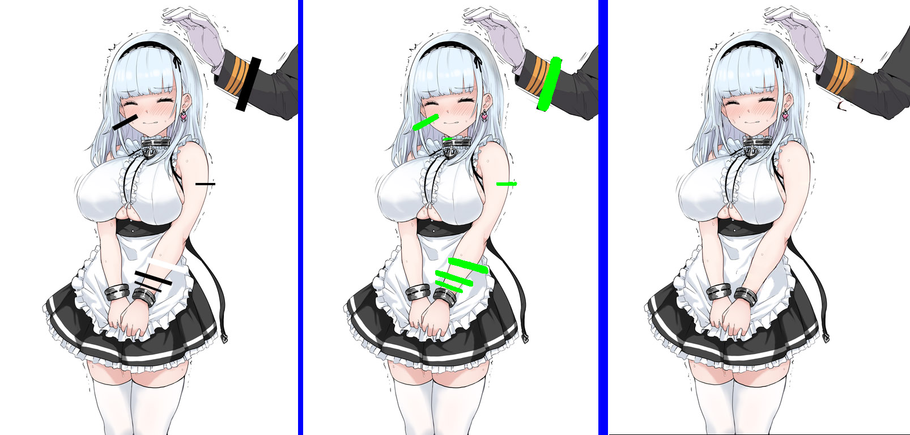
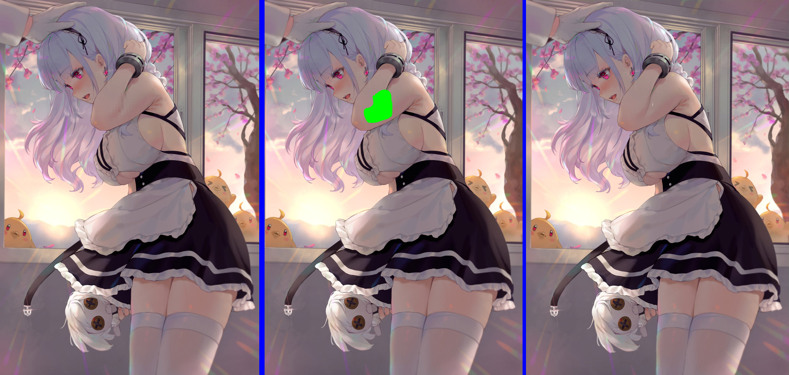

# Detecting censors with deep learning and computer vision

Illustrated adult content created in Japan is required to be censored by law. Two common types of censoring involves censor bars and mosaic blurs. For us degenerates living outside of Japan, this means we are also subject to the bars and mosaics. There is a solution, [DeepCreamPy](https://github.com/deeppomf/DeepCreamPy) by deeppomf that can draw over the censors, given that you tell it where the censors are. That is a long and painstaking process, so I hope to automate that process with this project. This project will utilize deep learning and image segmentation, techniques typically used in autonomous vehicles and computer vision tasks. New for 1.6.3, we added ESRGAN as an alternative to DeepCreamPy, which will also decensor a mosaic image/video after the detection.

This is built atop Matterport's [Mask R-CNN](https://arxiv.org/abs/1703.06870), and video decensoring uses [ESRGAN](https://arxiv.org/abs/1809.00219).

Here is a [NSFW Video](https://www.pornhub.com/view_video.php?viewkey=ph5e5bdbbcbce66) that shows better what this project does, on old model 161. 

Development news will be posted on my Twitter (NSFW).
[](https://twitter.com/nate_of_hent_ai)

Like what you see? You can send me a tip! (Proceeds also go to my tuition)
[](https://www.paypal.com/cgi-bin/webscr?cmd=_donations&business=CGF4Q3FK2Q2SU&currency_code=USD&source=url)

You can join development discussion on the Discord channel: https://discord.gg/j4dPZ7W 

Example of bar detection on model 226:


Examples of mosaic detection on model 236:


For both of those examples, the newest model 161 provides far more accurate masks and detection.

# Getting Started
You will need all the same requirements as matterport's Mask RCNN implementation, nothing more. Note that I am using tensorflow 1.8.0, tensorflow-gpu 1.9.0, torch 0.4.1, and keras 2.2.0. I have not been able to get newer combinations stable. I use Anaconda3 for my command line. 

Only windows is supported for the executable. You can pull this code for linux.

# The code

* [main.py](main.py) Contains GUI and all I/O handling and file parsing, along with basic error detection. Instantiates detector class.

* [detector.py](detector.py) Contains my detector class, which is responsible for neural network bringup, starting inference detection, and creating overlay from mask for DCP. No longer needs hentai.py, and can run detections on its own. Also handles ESRGAN functionality.

* [hentai.py](samples/hentai/hentai.py) Interfaces between my detector and the model. Based off of the Balloon.py of the Mask RCNN implementation. Only needed for training.

* [inspect_h_model.ipynb](samples/hentai/inspect_h_model.ipynb) This notebook is identical to the balloon notebook. I modified it to work with this project instead, and it is best used to inspect a model. For detailed logging, use Tensorboard (which should be installed if you have tensorflow)

* [inspect_h_data.ipynb](samples/hentai/inspect_h_data.ipynb)
Same thing as above, except this notebook is used to validate the dataset. Also has cool information showing some of the quirks and features of MaskRcnn

* [test_combined_generator.py](test_combined_generator.py) Script that automates bar censoring and annotation, more explained below. This is meant to be placed in a separate folder, and expects uncensored images in a folder called "decensored_input" and outputs the barred image into "decensored_input_original", and populates a csv with the annotations. You do not need to use this script, unless you want to help in expanding the dataset. In which case, join the discord and contact me.

* [hent_AI_COLAB_1.ipynb](hent_AI_COLAB_1.ipynb) Google Colab notebook with instructions for ESRGAN video decensoring. This will use Google's GPUs on the cloud for free, and should be faster than most, if not all consumer GPUs. But, sessions will get deleted after 30 minutes of idle or 12 hours. I reccommend this option for any sort of video decensoring, it is visually good enough and really fast.

* [green_mask_project_mosaic_resolution.py](green_mask_project_mosaic_resolution.py) Script from GMP that estimates a mosaic's granularity (size of the mosaic boxes) for use in ESRGAN decensoring.

# The Dataset

Extended the existing Balloon class to support 3 classes: BG, bar, and mosaic. I have decided to not provide my dataset. Annotated with VGG annotator in .json format.

Dataset annotations have were made with the polygon shape. Bar and Mosaic region attributes are formated as:

```
"region_attributes":{"censor":"bar"}} OR "region_attributes":{"censor":"mosaic"}}
```

Currently, the model needs a bigger database, namely with bar censors. Please contact me (Discord or Twitter) so I can provide the current dataset if you wish to train on your own. We are currently looking into dataset generation by censoring already uncensored images, as well as further image augmentation.
[Here](https://drive.google.com/open?id=1J0T6sZx8sN0wyo3Ctg88nlFWg414256j) is a (NSFW) sample of my dataset annotations, along with the vgg editor. You can start off of this sample and build off of it, and hopefully send your dataset to me so I can append it to the current dataset.

# The Model

I experimented with other pre-trained models, but ended transfer learning with the imagenet model. You will want the latest model for better accuracy.

* Model 161 (deprecated) 

* [Model 226](https://www.dropbox.com/s/08r26ho7yxx1fx8/weights226.zip?dl=0)

* [Model 236](https://www.dropbox.com/s/6liwqgop4kazot2/weights236.zip?dl=0) *Packaged with v1.5

* (Latest) [Model 268](https://www.dropbox.com/s/zvf6vbx3hnm9r31/weights268.zip?dl=0)

Simply delete your current weights.h5 file, and replace with the new one. Please keep the model named as weights.h5

ESRGAN is using Twittman's fatal pixels model for 4x superscaling. It is not on this repo as it is protected by MPL-2.0. Download the model 340000 [here](https://de-next.owncube.com/index.php/s/mDGmi7NgdyyQRXL) from his repo. Place this model in the main directory. 

## Requirements

You will need to download and install DeepCreamPy, which is linked in the intro.

The executable will need [ffmpeg](https://ffmpeg.org/) if you want sound to carry over on videos. Place ffmpeg.exe in the main directory, or somewhere defined in your PATH or in an environment variable. For linux, clone the repo and follow the provided instructions for getting its requirements. To get ffmpeg on linux or colab, use:

```
!sudo add-apt-repository ppa:jon-severinsson/ffmpeg
!sudo apt-get update
!sudo apt-get install ffmpeg
```

(Source code on Windows) I would reccomend running these on a virtual environment, with Anaconda3.
Python 3.5.2, TensorFlow 1.8, Keras 2.2, tensorflow-gpu 1.9.0, torch 0.4.1 and other common packages listed in `requirements.txt`.

* For now, DCP is required until I can create my own alternative. This project expects to use the DCP directory. You can install the executable or the source code, either should work.

* DCP is ONLY compatible with .png images, and not jpg. Either you use png only or try the provided jpg converter (Force jpg button). You can use online tools like jpg2png. Again, this should be done before anything else.

* DCP is NOT compatible with screentones, or that dotted effect that is characteristic of printed works (see below). Simply refer to my other project, [Screentone Remover](https://github.com/natethegreate/Screentone-Remover), which will batch remove screentones using Digital Signal Processing techniques. This is the only way for printed non-colored images to be decensored.

Here is an example of a screentoned image, and what it looks like when removed by my Screentone Remover app:


* For full video decensoring via ESRGAN, you will need to download Twittman's model [here](https://de-next.owncube.com/index.php/s/mDGmi7NgdyyQRXL) and place it inside the ColabESRGAN/models folder. 

* Nvidia GPU owners should install CUDA 9.0, and cuDNN 7.6.4. Note that there are issues with RTX cards and ESRGAN, so if you want to use that I again reccomend the colab notebook instead. 

## Important Notes (READ BEFORE USING)

* I highly reccommend running hent-AI on batches, for example one doujin or a few doujins at once. The slowest part of hent-AI is the initialization, so the first inference takes time but the rest will be quicker. 

* The current model is not perfect. Yet. Expect some trouble with white censor bars, small censor bars, partially-transparent censor bars, and censor bars that are fused together as one large censor. Any absurd amount of censoring may cause issues for hent-AI.

* This model is not trained in recognizing full censorship, where genetalia is not drawn at all. Non-standard censoring is also not supported. 

* The model supports mosaics and bars, but it really struggles when both are used on the same spot. Also, DCP can only generate for bars or mosaics, so you will need to keep mosaic censoring works separate from bar censored works. If you must decensor images with both, I  suggest decensoring the bars on one run, then the mosaics on a seconds run.

* CUDA compatible Nvidia GPUs are reccommended for large amounts of images, or videos. If you don't have one, refer to the [colab notebook](hent_AI_COLAB_1.ipynb).

* The Video Maker button creates a video from the output of DCP in decensored_output. Run this after DCP completes. Note you still need to select the directories for the source video, and the DCP install directory.

* Do not put entire clips through the video detection, it is a very slow task. If you can, edit in only the short clips with visible mosaics, get the decensored output, then edit them in the rest of the video.

* The compiled exe release does not support ESRGAN. If you want to use this, refer to the colab notebook.

## Versions and Downloads

* v1.0.0: Initial release for 2020 HackIllinois Demo

* v1.1.0: Cleaned code, removed unneeded library imports, added install instructions and tutorial. Added error detection.

* [v1.2.0](https://github.com/natethegreate/hentAI/releases/tag/v1.2): Executable release based off of the detect-only branch. Training and redundant libraries have been removed or relocated. Bug where entire image returns green fixed. Lowered detection threshold.

* v1.3.0: (exe not released yet) Removed non-unicode error. Added loading screen popup. Lowered detection threshold. Minor UI changes.

* v1.4.0: Fixed video detector incorrectly naming files. Added loading popup. UI tweaks. Lowered detection threshold.

* [v1.5.0](https://github.com/natethegreate/hentAI/releases/tag/v1.5): Fixed greyscale shape error. Fixed bug where video was copied to DCP folder. Added support for jpg, as an option for jpg to png conversion. Added better exception catching. Updated weights to model 236. 

* [v1.5.2](): Upgraded tensorflow to 1.8 in preparation for future video detection features. Image errors no longer stop program and get skipped. Terminal printing is more informative. UI Tweaks.

* [1.6.3](): Added ESRGAN for video decensoring, DCP not required for this. Further support for non-unicode filenames.

* [1.6.5](): Added adaptive mosaic granularity checking via GMP by rekaXua. Added colab file for free cloud-based ESRGAN video decensoring.

* [1.6.7](https://github.com/natethegreate/hent-AI/releases/tag/v1.6.7): Changed ESRGAN processs to run in 2 phases: ESRGAN resize, then mask detection. Slower but more memory forgiving. Added mask blurring for less seams on ESRGAN. For non-ESRGAN, added custom dilation to expand masks. Removed option for jpg, it will be used automatically. Improved file cleaning. 

* [1.6.8](): Videos will now take audio from the source video, using ffmpeg. Variable video bitrate is not yet available, so filesizes may not match the source. ESRGAN will now save videos to the same directory as the source video, mostly to help with the Colab.

* [1.6.9](): Minor UI tweaks. There is now a hconfig.ini that will save your previous used directories and settings on startup. During detection process for images and video, total image/frame count will be displayed.


## Installation directions

For detailed instructions, follow Install_and_Tutorial.txt

Executable:

* Install from the links above

* Extract to some folder

* Follow Install_and _tutorial for more

Code:

* After cloning this repo, first install the requirements:

```
pip install -r requirements.txt
```

* Next, compile maskrcnn:

```
python setup.py install
```

* To run hentAI, run

```
python main.py
```
In the main directory. Follow the UI instructions from there.

* Not needed, but to train, run

```
python samples\hentai\hentai.py train --dataset=dataset_img/ --weights=path/to/weights
```
Alternatively, you can resume training using --weights=last


## Contributing
Contributions and improvements to this repo are welcome, so I would encourage joining the Discord.


# Acknowledgements

Inspiration from [DeepCreamPy](https://github.com/deeppomf/DeepCreamPy)

Mask Rcnn implementation from [Matterport](https://github.com/matterport/Mask_RCNN)

Obtained weights from mattya's [chainer-DCGAN]( https://github.com/mattya/chainer-DCGAN)

ESRGAN implementation from [this paper](https://arxiv.org/abs/1809.00219), using their old architecture provided by [styler00dollar](https://github.com/styler00dollar/Colab-ESRGAN)

Using [Twittman's](https://github.com/alsa64/AI-wiki/wiki/Model-Database) trained model fatal pixels. 

Dataset annotated with [VGG annotator](http://www.robots.ox.ac.uk/~vgg/software/via/via.html)

Sample asset images from artist @ao_beni, 落書き色々まとめ, and @paxiti respectively. Screentone girl is from artist soranosuzume.

Current asset images from うぱ西まり子 and bibimbub on Pixiv.

